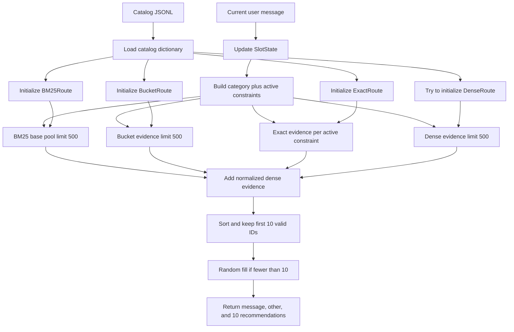
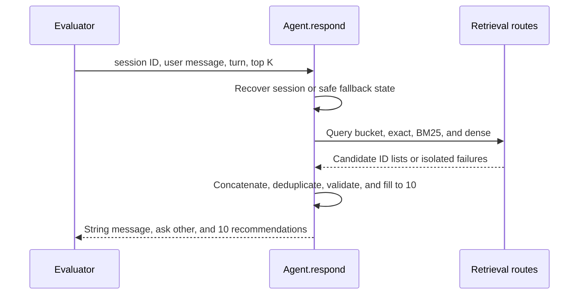
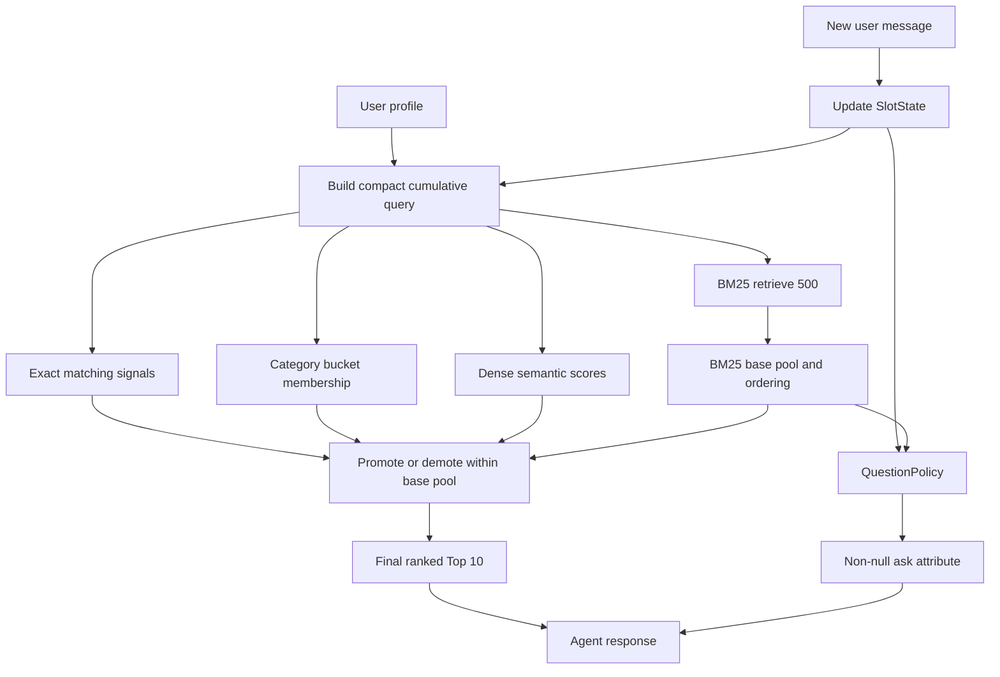

# Onboarding Guide to `starter/agent.py`

## 1. What `Agent` is responsible for

[`starter/agent.py`](../starter/agent.py) is the only competition deliverable
the evaluator directly calls. It owns catalog loading, retrieval-route startup,
per-session state, candidate collection, failure isolation, final recommendation
formatting, and the clarification attribute returned to the customer simulator.

The current implementation is a **working first hybrid pipeline**. `SlotState`
builds a cumulative query, BM25 supplies a 500-product base pool, and exact,
bucket, and dense evidence promote products within that pool using an
interpretable weighted score. It deliberately does not inject non-BM25 products
yet; that is a later recall enhancement.

The two required public methods are:

```python
agent.reset(session_id, user_profile)
response = agent.respond(session_id, user_message, turn, top_k)
```

## 2. Current completion status

### Requirement audit

| Requirement | Status | Evidence or gap |
|---|---|---|
| Crude working agent before optimization | Complete | Clean evaluator runs finish on tune and holdout |
| Return exactly 10 every turn | Complete | `RECOMMENDATION_COUNT = 10`, random fill, unit tests |
| Never return null `ask_attribute` | Complete | `respond()` always returns `"other"` |
| Always return a string `message` | Complete | Constant string in every response |
| Call bucket route | Complete | `BucketRoute` is initialized and queried |
| Call exact route | Complete | `ExactRoute` is initialized and queried |
| Call BM25 route | Complete | `BM25Route` is initialized and queried |
| Call dense route | Complete | The supplied 50k cache is loaded; smoke initialization reports no route errors |
| Integrate dialog teammate module | Partial | `SlotState` accumulation/override is connected; `QuestionPolicy` is not yet used |
| Retrieve 500 BM25 candidates | Complete | `ROUTE_CANDIDATE_LIMIT = 500` and the route-adapter test verifies it |
| Preserve route scores and identity | Complete | `_route_candidates()` returns a scored list for each named route |
| Narrow and rescore a wide BM25 pool | Complete, v1 | Rank-normalized BM25 is adjusted by exact, bucket, and normalized dense evidence |
| Isolate route failures | Complete | Initialization and every route call have separate exception handling |
| Evaluation script and CSV logging | Complete | `scripts/eval.py` and `runs.csv` exist |
| Fixed 140/60 split | Complete | `data/eval_split.json` is committed |
| Avoid equal-weight RRF | Complete | No RRF is implemented |
| BM25 as base ordering | Complete | `_fuse_bm25_pool()` admits only BM25 candidates and uses BM25 rank as its tie-breaker |
| First fused score reported | Complete | Tune and holdout measurements are documented below and logged in `runs.csv` |

As a practical summary:

- The **reliability and measurement shell is complete**.
- The **four retrieval adapters and supplied dense cache are connected**.
- The **500-candidate BM25-base fusion and accumulated slot query work end to
  end**.
- Fusion weights, candidate injection, attribute selection, and richer
  constraint-violation features remain improvement work.

## 3. First fused measurement

The fixed tune and holdout splits were evaluated with the supplied dense cache.
The previous route-concatenation score is shown for comparison:

| Split | Version | Samples | Technical score | Hit@10 | MRR | MTTC |
|---|---|---:|---:|---:|---:|---:|
| Tune | Previous concatenation | 140 | 0.658371 | 0.764286 | 0.432188 | 3.671429 |
| Tune | **BM25 fusion v1** | 140 | **0.818984** | **0.942857** | **0.597089** | **2.578571** |
| Holdout | Previous concatenation | 60 | 0.656248 | 0.783333 | 0.393049 | 3.666667 |
| Holdout | **BM25 fusion v1** | 60 | **0.822776** | **0.950000** | **0.598142** | **2.583333** |

### Tune scenarios

| Scenario | N | Hit@10 | MRR | MTTC |
|---|---:|---:|---:|---:|
| Buying | 56 | 0.946429 | 0.518892 | 2.053571 |
| Browsing | 56 | 0.946429 | 0.642708 | 2.428571 |
| Intent override | 21 | 0.904762 | 0.738946 | 4.333333 |
| Boundary | 7 | 1.000000 | 0.432143 | 2.714286 |

### Holdout scenarios

| Scenario | N | Hit@10 | MRR | MTTC |
|---|---:|---:|---:|---:|
| Buying | 24 | 0.958333 | 0.631019 | 2.041667 |
| Browsing | 24 | 0.958333 | 0.525794 | 2.416667 |
| Intent override | 9 | 0.888889 | 0.666667 | 4.222222 |
| Boundary | 3 | 1.000000 | 0.708333 | 3.333333 |

These numbers validate the pipeline shape before weight tuning. The largest
change is intent override: accumulating active constraints and demoting the old
preference raised tune Hit@10 from `0.285714` to `0.904762`.

## 4. Architecture at a glance

### Current architecture



### Important consequence

BM25 now controls candidate admission. Exact, bucket, and dense can promote only
products already in the BM25 top 500. This makes the first fusion version easy
to reason about, but it cannot rescue a target that BM25 fails to retrieve.

## 5. Constants

```python
RECOMMENDATION_COUNT = 10
ROUTE_CANDIDATE_LIMIT = 500
RANDOM_FILL_SEED = "kwekers-day1-random-fill-v1"
EXACT_MATCH_BOOST = 0.35
BUCKET_MATCH_BOOST = 0.10
DENSE_SIMILARITY_WEIGHT = 0.20
```

### `RECOMMENDATION_COUNT`

Hard-codes the output length required by the Day 1 strategy. The evaluator
scores at most ten valid unique recommendations, so returning fewer gives away
free guesses.

### `ROUTE_CANDIDATE_LIMIT`

Every route currently receives `limit=500`. This satisfies the wide-retrieval
requirement. A later tuning pass may use separate constants such as:

```python
BM25_CANDIDATE_LIMIT = 500
SUPPORTING_ROUTE_LIMIT = 500
```

This makes it possible to tune route sizes independently.

### `RANDOM_FILL_SEED`

Makes fallback recommendations reproducible. It is not intended to improve
retrieval quality; it only ensures a complete response when routes return fewer
than ten usable products.

## 6. `Agent.__init__()`

```python
agent = Agent("data/catalog.jsonl")
```

Initialization performs four steps:

1. Normalize the catalog path.
2. Load the full catalog into memory.
3. Create catalog ID collections and an empty session dictionary.
4. Initialize each retrieval route independently.

```python
self._catalog = self._load_catalog()
self._catalog_ids = list(self._catalog)
self._catalog_id_set = set(self._catalog_ids)
self._sessions = {}
self._initialize_routes()
```

The dictionary preserves catalog order in modern Python. That order later
affects bucket ordering and deterministic fallback behavior.

### Current runtime availability

On the present machine:

```text
BucketRoute = available
ExactRoute  = available
BM25Route   = available
DenseRoute  = available with supplied 50k cache
```

The supplied `data/dense_cache.npz` contains 50,000 ASINs and a `50000 x 384`
embedding matrix. A real-agent smoke test initialized all routes in 21.25
seconds and produced a fused response in 0.256 seconds. Runtime checks for this
cache before constructing `DenseRoute`, so evaluator startup cannot
accidentally trigger a full catalog encode. Dense remains failure-isolated when
the dependency, model, or cache is absent. `Agent` also passes
`build_if_missing=False`, so an existing but mismatched cache fails closed
instead of starting generation; only the standalone builder permits encoding.

## 7. `_load_catalog()`

This helper reads the catalog into:

```python
dict[parent_asin, product_dictionary]
```

### Example input JSONL

```json
{"parent_asin":"A1","title":"Blue Cotton Shirt"}
{"parent_asin":"A2","title":"Black Leather Boot"}
```

### Result

```python
{
    "A1": {"parent_asin": "A1", "title": "Blue Cotton Shirt"},
    "A2": {"parent_asin": "A2", "title": "Black Leather Boot"},
}
```

Malformed JSON rows, non-dictionaries, and missing IDs are skipped. Duplicate
IDs keep their first product. A missing or unreadable file produces `{}` rather
than crashing agent construction.

This is deliberately defensive, although silently skipping malformed catalog
data can make diagnostics harder. Production-quality logging could report the
number of skipped rows without breaking the response contract.

## 8. `_initialize_routes()`

This function imports and constructs every retrieval route independently:

```python
try:
    from src.buckets import BucketRoute
    self._bucket_route = BucketRoute(self._catalog)
except Exception:
    self._bucket_route = None
```

The same structure is repeated for exact, BM25, and dense.

### Why import inside the function?

Optional dependencies are isolated. Importing `starter.agent` does not fail
merely because dense-model dependencies are absent.

### Why one `try` per route?

If DenseRoute fails, BM25 and exact search remain usable. A single broad `try`
around every constructor would incorrectly disable all later routes after one
failure.

### Limitation

All exceptions are silent. This protects evaluation, but developers cannot see
which route failed without inspecting private attributes. A later improvement
could store health information:

```python
self._route_health = {
    "dense": "SentenceTransformer dependency unavailable",
}
```

## 9. `reset()`

The evaluator calls:

```python
agent.reset(session_id, user_profile)
```

Current state stored per session:

```python
{
    "seed_key": "sha256-of-profile",
    "user_profile": safe_profile,
}
```

### Example

```python
agent.reset(
    "session-1",
    {"summary": "Prefers durable, comfortable products"},
)
```

Conceptual result:

```python
agent._sessions["session-1"] = {
    "seed_key": "<stable SHA-256 hex string>",
    "user_profile": {
        "summary": "Prefers durable, comfortable products",
    },
}
```

The profile hash ensures random fill is stable even though evaluator session
IDs contain random UUIDs.

### Major missing integration

`src.dialog.SlotState` is not created here. Consequently, the agent does not
currently retain:

- Accumulated constraints from earlier user turns
- Asked attributes
- Boundary replies
- Intent exhaustion
- Override history
- Active versus demoted preferences

The final version should store a `SlotState` and perhaps a `QuestionPolicy` in
each session.

## 10. `_query_route()`

All teammate retrieval routes follow this interface:

```python
route.query(text, limit) -> list[tuple[parent_asin, score]]
```

`_query_route()` adapts that into an ID-only list.

### Example route output

```python
[
    ("A1", 12.7),
    ("A2", 9.4),
]
```

### Current adapter output

```python
[
    ("A1", 12.7),
    ("A2", 9.4),
]
```

It validates the outer list, ASIN, and finite numeric score before preserving
the pair:

```python
candidates.append((parent_asin, float(score)))
```

### Why preserving scores matters

The next fusion layer can now distinguish:

```text
Exact match with score 1.0
Weak dense similarity with score 0.21
Strong BM25 result with score 3020
```

`_route_candidates()` also preserves the route name. The remaining work is to
normalize and apply these incomparable score scales in a BM25-base fusion.

## 11. Route adapters

These four functions currently have the same shape:

```python
def _route_bm25(self, session, user_message, turn):
    return self._query_route(self._bm25_route, user_message)
```

The available arguments anticipate future behavior:

- `session` can provide accumulated dialog state.
- `user_message` is the newest customer message.
- `turn` can support turn-aware strategy.

At present, only `user_message` is used.

### Bucket route

`BucketRoute` extracts a coarse category from evaluator opening-message
templates and returns catalog-ordered products in that category.

Useful for candidate filtering, but its order is not relevance ranking. It
should normally constrain or boost BM25 candidates rather than become the base
Top 10.

### Exact route

`ExactRoute` indexes cleaned feature strings and `key: value` detail pairs. It
can be extremely strong because the simulator derives customer constraints
from the same product metadata.

Its extraction currently captures the whole matters clause. A message with two
semicolon-separated constraints may not match separately, which is a future
improvement opportunity.

### BM25 route

`BM25Route` uses SQLite FTS5 with weighted fields and a strictness cascade:

```text
exact phrases -> all terms -> any term
```

This is the best current candidate for the requested base ordering.

### Dense route

`DenseRoute` uses `BAAI/bge-small-en-v1.5` embeddings. Its cached 50,000 by 384
float16 matrix is about 38 MB on disk. It is feasible in memory, but requires
model dependencies and a prepared cache.

```bash
python -m pip install -r requirements-dense.txt
```

The supplied `data/dense_cache.npz` is already complete and is the runtime
source; do not regenerate it during ordinary development or evaluation. The
artifact is intentionally gitignored. `scripts/build_dense_cache.py` remains a
recovery tool for a genuinely missing cache, but a CPU rebuild may take hours.

### Existing but unused N-gram route

`src.retrieval.NgramRoute` provides character 3-to-5-gram TF-IDF for fuzzy and
truncated constraints. `Agent` does not initialize or call it. If this module
belongs to the agreed teammate surface, it remains an integration gap.

## 12. `_route_candidates()`

This function calls every named adapter inside an independent `try` block:

```python
for name, route in routes:
    try:
        candidates = route(session, user_message, turn)
    except Exception:
        candidates = []
    route_results[name] = candidates
```

Its output preserves route identity, ranking, and scores. `_fuse_bm25_pool()`
then admits only BM25 candidates, normalizes BM25 rank, applies supporting
evidence, and sorts by fused score with original BM25 rank as the tie-breaker.

### Example

Suppose routes return:

```python
bucket = [("A", 1.0), ("B", 0.8), ("C", 0.7)]
exact  = [("C", 1.0), ("TARGET", 1.0)]
bm25   = [("TARGET", 3020.0), ("D", 3010.0), ("A", 3001.0)]
dense  = [("E", 0.82), ("TARGET", 0.80)]
```

With illustrative normalized values, the fused output could be:

```python
["TARGET", "D", "A"]
```

`E` is excluded because it is absent from the BM25 pool. `TARGET` can be
promoted because it has both exact and dense evidence. `A` remains eligible
because BM25 retrieved it even though the other routes are weaker.

### Route failure example

If exact raises an exception:

```python
bucket = [("A", 1.0), ("B", 0.8), ("C", 0.7)]
exact  = exception
bm25   = [("TARGET", 3020.0), ("D", 3010.0)]
```

Fusion still returns BM25 candidates:

```python
["TARGET", "D"]
```

This satisfies the requirement that one teammate's crash must not zero the
whole evaluation turn.

## 13. `_random_fill()`

Despite its name, this function has two responsibilities:

1. Validate and truncate routed candidates to ten.
2. Randomly fill any missing output positions.

It first keeps catalog-valid unique route candidates:

```python
for parent_asin in candidates:
    if parent_asin in catalog and parent_asin not in seen:
        result.append(parent_asin)
    if len(result) == 10:
        return result
```

If only seven survive, it selects three deterministic random catalog IDs. If
the catalog is unavailable, unique placeholder IDs preserve the response
schema and exact list length, although the evaluator will discard them as
invalid.

### Example

```python
candidates = ["A", "A", "MISSING", "B"]
```

With `A` and `B` in the catalog, the result begins:

```python
["A", "B", ...eight deterministic random valid IDs...]
```

This helper is the final safety net enforcing the ten-recommendation rule.

## 14. `respond()`

`respond()` is the public turn entry point.



### Example input

```python
response = agent.respond(
    session_id="session-1",
    user_message=(
        "I'm looking for Jewelry Necklaces. "
        "A key requirement is: Material:alloy."
    ),
    turn=1,
    top_k=10,
)
```

### Output shape

```python
{
    "message": "I am refining the shortlist. What else should I consider?",
    "ask_attribute": "other",
    "recommendations": [
        {"parent_asin": "A1"},
        # exactly nine more
    ],
    "usage": {
        "prompt_tokens": 0,
        "completion_tokens": 0,
    },
}
```

The entire body has a final exception fallback, while route-level isolation
already handles expected teammate failures.

The supplied `top_k` argument is currently ignored in favor of the hard-coded
ten-item competition rule.

## 15. Teammate modules and their integration state

| Module | Main runtime pieces | Current Agent use |
|---|---|---|
| `src/buckets.py` | `BucketRoute` | Initialized and queried |
| `src/exact.py` | `ExactRoute` | Initialized and queried |
| `src/retrieval.py` | `BM25Route` | Initialized and queried |
| `src/retrieval.py` | `DenseRoute` | Connected and using supplied 50k cache |
| `src/retrieval.py` | `NgramRoute` | Not used |
| `src/dialog.py` | `SlotState` | Created per session; accumulates and overrides active constraints |
| `src/dialog.py` | `ScenarioRouter` | Used indirectly by `SlotState.update()` |
| `src/dialog.py` | `QuestionPolicy` | Not yet used; agent still asks `other` |

### What the dialog module provides

`SlotState.update()` can:

- Parse key requirements and multi-constraint replies
- Accumulate constraints across turns
- Detect boundary replies
- Detect exhausted `other` responses
- Recognize intent overrides
- Demote the overridden preference
- Produce a compact structured context

`QuestionPolicy.next_attribute()` can:

- Ask `other` while the public intent card is still being drained
- Avoid null attributes
- Use candidate information-gain scores later
- Fall back through useful specific attributes

Connecting these classes is the most direct path to improving intent-override
performance.

## 16. What the end goal should look like

The final system should not treat route outputs as equal lists. It should use
BM25 to define a broad candidate pool, then let other signals move products
within that pool.



### Suggested non-RRF fusion shape

Preserve route scores instead of converting immediately to IDs:

```python
bm25_results = bm25.query(query, limit=500)
exact_ids = {asin for asin, _ in exact.query(query, limit=500)}
bucket_ids = set(bucket.bucket_for_message(opening_message))
dense_scores = dict(dense.query(query, limit=500))
```

Initialize candidates from BM25 rank:

```python
for bm25_rank, (asin, bm25_score) in enumerate(bm25_results, start=1):
    fused[asin] = {
        "base_rank": bm25_rank,
        "score": normalized_bm25_score,
    }
```

Then apply interpretable adjustments:

```python
if asin in exact_ids:
    score += exact_boost
if bucket_is_known and asin not in bucket_ids:
    score -= category_penalty
score += dense_weight * normalized_dense_score
```

This obeys the instruction to start with BM25 ordering and let teammate signals
promote or demote. It is not equal-weight reciprocal-rank fusion.

## 17. Dialog-state integration

`reset()` now creates state resembling:

```python
from src.dialog import QuestionPolicy, SlotState

self._sessions[session_id] = {
    "user_profile": user_profile,
    "slot_state": SlotState(session_id=session_id),
    "category": "",
    "active_constraints": [],
}
```

Every `respond()` call now:

```python
state.update(user_message, turn)
query = category + active_constraints
route_results = query_all_routes(query)
candidates = fuse_bm25_pool(route_results)
state.record_ask("other")
```

This fixes the previous latest-message-only defect. Earlier category and active
constraints remain in the query, while `SlotState` demotes the old preference
after an override. `QuestionPolicy` and information gain remain unconnected.

## 18. Why intent override improved

The tune intent-override metrics are:

```text
Hit@10 = 0.904762
MRR    = 0.738946
MTTC   = 4.333333
```

The mechanisms are visible in the code:

1. `SlotState` remembers earlier active constraints.
2. The cumulative query retains the product category across turns.
3. An override demotes the old preference and activates the replacement.
4. BM25 remains the candidate base while exact and dense evidence can promote
   the target after the override becomes eligible.

The remaining gap is not basic state integration; it is improving question
selection and fusion without overfitting the small public sample.

## 19. Evaluation workflow

The temporary debug statements and unconditional one-session `break` have been
removed from `evaluator/local_evaluator.py`. The standard commands are:

```bash
python scripts/eval.py --split tune --label your-change-name
python scripts/eval.py --split holdout --label your-change-name
```

The script:

1. Loads the committed split manifest.
2. Runs the evaluator.
3. Prints overall and per-scenario metrics.
4. Writes a detailed ignored result JSON.
5. Appends one timestamped row to `runs.csv`.

Use tune for ordinary iteration. Run holdout only at meaningful checkpoints so
the team does not gradually optimize against it.

## 20. Tests and safety guarantees

The current repository has 26 passing tests. Agent-specific tests verify:

- Exactly ten unique recommendations
- A non-null `"other"` question
- Missing-catalog survival
- Calling `respond()` without `reset()` does not crash
- One broken route does not break the response
- Stable random fill across evaluator UUIDs
- Every route adapter delegates with the 500-candidate limit
- Route identity and finite scores are preserved
- BM25 is the exclusive v1 candidate pool
- Exact and dense evidence promote in-pool candidates
- Active constraints accumulate across turns
- An override removes the old preference from the active query
- A missing dense cache cannot trigger an automatic catalog encode

Tests establish the shell contract, but do not yet verify:

- Exact numeric fusion weights against a golden catalog fixture
- Candidate injection for exact or dense results outside BM25
- Information-gain question selection
- Full dense-cache integrity in unit tests

## 21. Recommended next implementation order

### Next correctness pass

1. Add lightweight cache metadata validation without loading all embeddings.
2. Connect `QuestionPolicy` and candidate-pool information gain.
3. Add diagnostics that expose per-route ranks and fused scores for one session.
4. Tune weights on tune only and confirm meaningful checkpoints on holdout.

### Later improvement pass

1. Split multi-constraint exact queries on semicolons.
2. Add the N-gram route if agreed by the team.
3. Compute candidate-pool attribute information gain.
4. Tune signal weights on tune only.
5. Benchmark and validate dense recall from the supplied cache.
6. Add route latency and health diagnostics.

## 22. Key takeaways for a new contributor

1. `Agent` already produces valid responses and calls four route adapters.
2. Ten recommendations, a string message, and non-null asking are guaranteed.
3. The current high score comes from useful teammate route implementations,
   especially exact and BM25 retrieval.
4. The main remaining retrieval limitation is that exact and dense cannot rescue
   candidates outside BM25's top 500.
5. The current weights are intentionally simple and have not been systematically
   tuned.
6. The next goal is better diagnostics and question selection before introducing
   broader candidate injection or more complex rankers.
