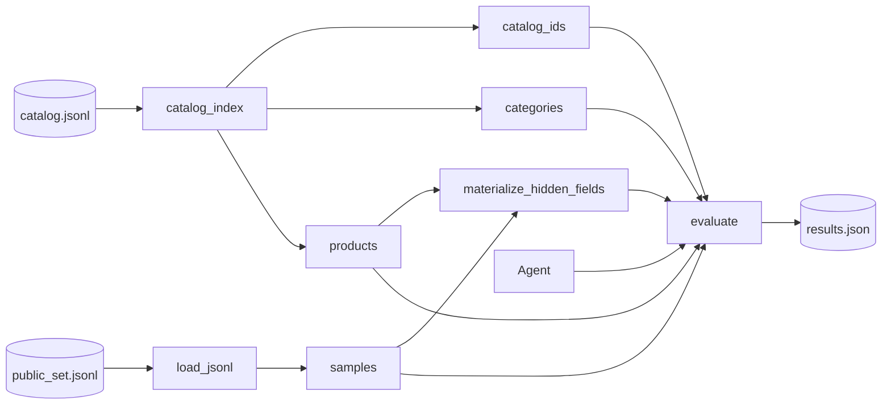
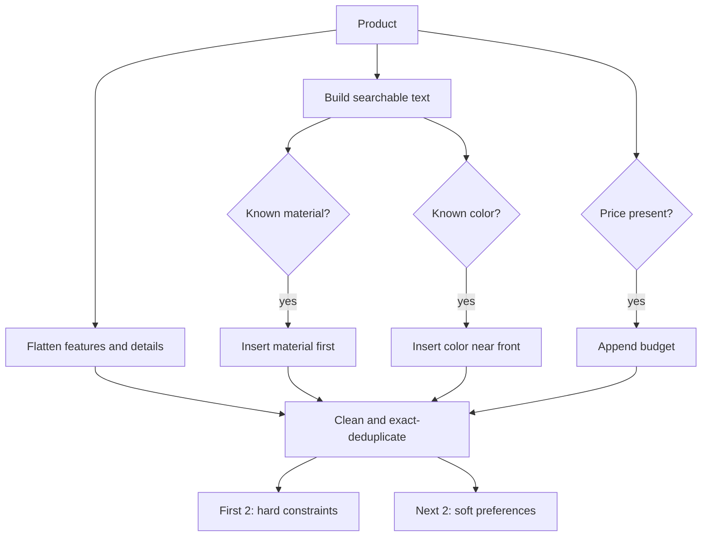
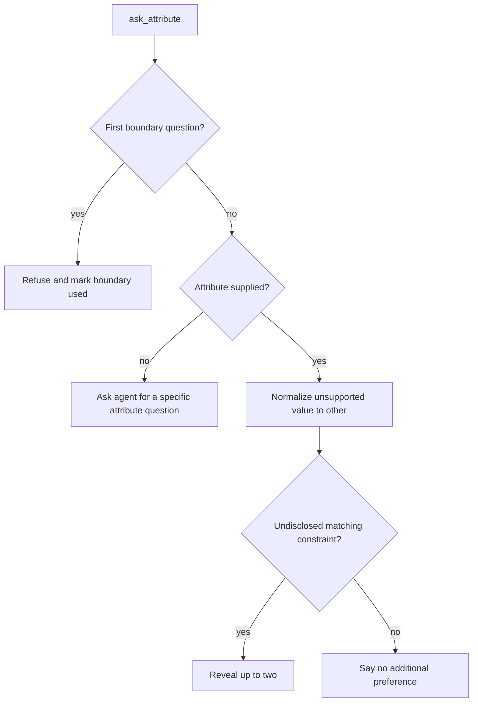
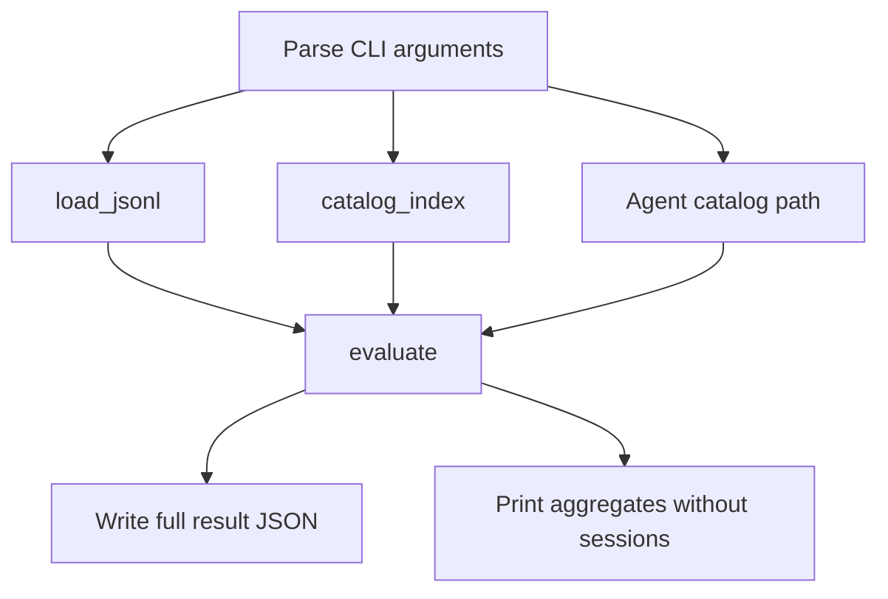

# Beginner's Guide to `local_evaluator.py`

## 1. Purpose

[`evaluator/local_evaluator.py`](../evaluator/local_evaluator.py) is both a **customer simulator** and a **scoring harness** for a conversational shopping agent. For every evaluation sample, it derives a hidden shopping intent from the target product, converses with an `Agent` for at most ten turns, and measures whether the exact target product appears in the agent's valid Top 10 recommendations.

The key mental model is:

> The evaluator plays the customer and the referee. `starter.agent.Agent` plays the shopping assistant.

## 2. Architecture at a glance



The helpers form four layers:

| Layer | Responsibility | Functions |
|---|---|---|
| Product normalization | Turn mixed catalog fields into constraints | `searchable_text`, `_flatten_values`, `_clean_constraint`, `intent_card` |
| Simulation | Decide what the customer says | `behavior_for`, `coarse_category`, `classify_constraint`, `initial_message`, `customer_reply` |
| Loading and validation | Read JSONL and sanitize IDs | `load_jsonl`, `catalog_index`, `normalize_recommendations`, `materialize_hidden_fields` |
| Orchestration and scoring | Run sessions and calculate results | `metric_summary`, `evaluate`, `main` |

## 3. Important data shapes

### Catalog product

```python
product = {
    "parent_asin": "A123",
    "title": "Blue Cotton Running Shirt",
    "features": ["Breathable", "Machine washable"],
    "details": {"fit": "regular", "sleeve": "short"},
    "description": ["Lightweight gym shirt"],
    "categories": ["Clothing", "Men", "Active Shirts"],
    "store": "Example Sports",
    "price": 29.99,
}
```

### Evaluation sample

```python
sample = {
    "sample_id": "public_v2_0001",
    "scenario_type": "buying",
    "user_profile": {"summary": "Prefers practical sportswear"},
    "ground_truth": {"parent_asin": "A123"},
}
```

### Hidden intent card

```python
{
    "target_category": "Blue Cotton Running Shirt",
    "hard_constraints": ["cotton", "color: blue"],
    "soft_preferences": ["Breathable", "Machine washable"],
}
```

The agent never receives this dictionary directly. The simulator gradually reveals parts of it through customer messages.

### Agent response

```python
{
    "message": "Do you have a material preference?",
    "ask_attribute": "material",
    "recommendations": [{"parent_asin": "A123"}],
    "usage": {"prompt_tokens": 120, "completion_tokens": 30},
}
```

`MAX_TURNS = 10` limits the conversation. `TOP_K = 10` means only the first ten valid, unique IDs are scored.

## 4. Function-by-function guide

### `searchable_text(product)`

Combines selected catalog fields into one searchable string. Dictionaries become `key value` fragments, lists contribute each item, scalar values are stringified, and missing values are ignored. Only `title`, `features`, `details`, `description`, `categories`, and `store` are considered; price is handled separately.

```python
from evaluator.local_evaluator import searchable_text

product = {
    "title": "Blue Shoe",
    "features": ["Light", "Soft"],
    "details": {"material": "cotton"},
    "store": None,
}
print(searchable_text(product))
# Blue Shoe Light Soft material cotton

print(searchable_text({"title": "Plain Hat", "price": 12.50}))
# Plain Hat
```

Why: material/color detection can search one uniform string rather than understand every possible field type.

### `_flatten_values(value)`

Converts a dictionary, list, scalar, or empty value into a list of non-empty readable strings. The underscore signals an internal helper.

```python
from evaluator.local_evaluator import _flatten_values

print(_flatten_values({"fit": "regular", "empty": "", "color": "blue"}))
# ['fit: regular', 'color: blue']

print(_flatten_values(["cotton", "", None, "soft"]))
# ['cotton', 'soft']
```

Dictionary keys are retained because `fit: regular` carries more context than `regular`.

### `_clean_constraint(value, limit)`

Collapses whitespace, strips surrounding punctuation, truncates to a character limit, and removes trailing whitespace.

```python
from evaluator.local_evaluator import _clean_constraint

print(_clean_constraint("  -- Water   resistant...  ", 30))
# Water resistant

print(_clean_constraint("lightweight and breathable", 11))
# lightweight
```

The default `intent_card` limit is 180, so mid-word truncation is possible but uncommon.

### `intent_card(product, limit=180)`

Creates the hidden shopping brief. It starts with features and details, promotes the first recognized material and color, appends a budget when price exists, removes exact duplicate strings, and selects at most four candidates.



Example 1:

```python
from evaluator.local_evaluator import intent_card

product = {
    "title": "Blue Cotton Running Shirt",
    "features": ["Breathable fabric", "Moisture wicking"],
    "details": {"fit": "regular"},
    "price": 29.99,
}
print(intent_card(product))
```

Output:

```python
{
    'target_category': 'Blue Cotton Running Shirt',
    'hard_constraints': ['cotton', 'color: blue'],
    'soft_preferences': ['Breathable fabric', 'Moisture wicking'],
}
```

The fit and budget are valid candidates but fall beyond the first four positions.

Example 2, no useful metadata:

```python
print(intent_card({
    "title": "Minimal Mystery Product",
    "features": [],
    "details": {},
    "price": None,
}))
```

Output:

```python
{
    'target_category': 'Minimal Mystery Product',
    'hard_constraints': ['Minimal Mystery Product'],
    'soft_preferences': ['Minimal Mystery Product'],
}
```

The title is the fallback. It appears in both lists because there are no third or fourth candidates.

### `behavior_for(scenario, card, rng)`

Builds scenario policy. Ordinary scenarios need only their type. `intent_override` also schedules a change of mind on turn 3 or 4. An injected `random.Random` makes this testable and reproducible.

```python
import random
from evaluator.local_evaluator import behavior_for

card = {
    "hard_constraints": ["cotton", "color: blue"],
    "soft_preferences": ["lightweight", "budget around $30"],
}

print(behavior_for("buying", card, random.Random(7)))
# {'scenario_type': 'buying'}

print(behavior_for("intent_override", card, random.Random(7)))
```

Second output:

```python
{
    'scenario_type': 'intent_override',
    'override': {
        'turn': 4,
        'old_value': 'budget around $30',
        'new_value': 'cotton',
        'message': 'Actually, ignore my earlier preference. What I need is: cotton.',
    },
}
```

### `load_jsonl(path)`

Loads every non-blank line of a UTF-8 JSON Lines file into a list. Given `samples.jsonl`:

```json
{"sample_id":"s1","scenario_type":"buying"}

{"sample_id":"s2","scenario_type":"browsing"}
```

```python
from evaluator.local_evaluator import load_jsonl

print(load_jsonl("samples.jsonl"))
# [{'sample_id': 's1', 'scenario_type': 'buying'},
#  {'sample_id': 's2', 'scenario_type': 'browsing'}]
```

The whole dataset is held in memory. This favors simplicity and is appropriate for the public set's size.

### `normalize_recommendations(payload, catalog_ids)`

Treats agent output as untrusted. It accepts direct strings or dictionaries containing `parent_asin`, strips whitespace, rejects unknown and duplicate IDs, preserves first-valid order, and stops after ten valid products.

```python
from evaluator.local_evaluator import normalize_recommendations

payload = [
    {"parent_asin": "A"},
    {"parent_asin": "UNKNOWN"},
    {"parent_asin": "A"},
    "B",
    {"parent_asin": "C"},
]
print(normalize_recommendations(payload, {"A", "B", "C"}))
# ['A', 'B', 'C']

print(normalize_recommendations({"parent_asin": "A"}, {"A"}))
# []   (the outer value must be a list)
```

The normalized position matters because it determines reciprocal rank.

### `catalog_index(catalog_path)`

Reads the catalog once and returns three lookup structures:

```python
identifiers: set[str]
categories: dict[str, list[str]]
products: dict[str, dict]
```

Given:

```json
{"parent_asin":"A","title":"Blue Shoe","categories":["Clothing","Shoes"]}
{"parent_asin":"B","title":"Red Hat","categories":["Clothing","Accessories"]}
```

```python
from evaluator.local_evaluator import catalog_index

ids, categories, products = catalog_index("catalog.jsonl")
print(ids)                    # {'A', 'B'} (set order may vary)
print(categories["A"])       # ['Clothing', 'Shoes']
print(products["A"]["title"]) # Blue Shoe
```

The set gives fast ID validation; the smaller category map builds opening messages; the full product map reconstructs hidden intent.

### `coarse_category(values)`

Creates a natural category phrase. It splits comma-separated values, removes generic clothing roots, and keeps the last two useful parts.

```python
from evaluator.local_evaluator import coarse_category

print(coarse_category([
    "Clothing, Shoes & Jewelry", "Women", "Athletic Shoes"
]))
# Women Athletic Shoes

print(coarse_category(["Clothing"]))
# clothing item
```

### `classify_constraint(value)`

Maps free text onto a permitted clarification attribute using ordered keyword rules. The first match wins: budget, material, color, size, style, use case, then the `feature` fallback.

```python
from evaluator.local_evaluator import classify_constraint

tests = [
    "$50 or under", "100% cotton", "color: blue",
    "wide width", "winter hiking", "zip pockets",
]
for value in tests:
    print(value, "->", classify_constraint(value))
```

Output:

```text
$50 or under -> budget
100% cotton -> material
color: blue -> color
wide width -> size
winter hiking -> use_case
zip pockets -> feature
```

This is the bridge between an agent asking for `material` and the simulator finding a hidden constraint such as `cotton`.

### `initial_message(sample, category, disclosed)`

Creates turn one's customer message and mutates the `disclosed` set when it reveals a constraint.

```python
from evaluator.local_evaluator import initial_message

sample = {
    "scenario_type": "buying",
    "intent_card": {"hard_constraints": ["cotton", "color: blue"]},
}
disclosed = set()
print(initial_message(sample, "Men Active Shirts", disclosed))
# I'm looking for Men Active Shirts. A key requirement is: cotton.
print(disclosed)
# {'cotton'}

sample["scenario_type"] = "browsing"
print(initial_message(sample, "Men Active Shirts", set()))
# I'm looking for Men Active Shirts, but I'm still exploring.
```

Buying reveals the first hard constraint. Browsing remains vague. Intent override begins with the old preference stored in `behavior.override.old_value`.

### `customer_reply(sample, ask_attribute, disclosed, boundary_used)`

Generates the next customer message from the agent's requested attribute. It returns `(message, updated_boundary_used)`.

Decision order:

1. A boundary customer refuses the first real attribute question.
2. No attribute prompts the agent to ask one specific question.
3. Unsupported attributes become `other`.
4. Up to two matching, undisclosed constraints are revealed.
5. With no match, the customer says there is no additional preference.

```python
from evaluator.local_evaluator import customer_reply

sample = {
    "scenario_type": "buying",
    "intent_card": {
        "hard_constraints": ["cotton", "color: blue"],
        "soft_preferences": ["lightweight", "budget around $30"],
    },
}

print(customer_reply(sample, "material", set(), False))
# ('For that, what matters is: cotton.', False)

print(customer_reply(sample, None, set(), False))
# ('Those options are not quite right yet. Ask me about one specific attribute.', False)
```

For a boundary sample's first material question, the message is `I don't have a preference for material; please use your judgment.` and the returned flag becomes `True`.

### `metric_summary(sessions)`

Calculates three core metrics:

- **Hit Rate@10:** fraction of sessions where the target appeared.
- **MRR:** mean of `1 / target rank`; misses contribute zero.
- **MTTC:** mean first-hit turn; misses are assigned turn 11.

```python
from evaluator.local_evaluator import metric_summary

sessions = [
    {"hit": True,  "reciprocal_rank": 1.0, "first_hit_turn": 1},
    {"hit": True,  "reciprocal_rank": 0.5, "first_hit_turn": 3},
    {"hit": False, "reciprocal_rank": 0.0, "first_hit_turn": None},
]
print(metric_summary(sessions))
# {'sample_count': 3, 'hit_rate_at_10': 0.666667,
#  'mrr': 0.5, 'mttc': 5.0}

print(metric_summary([]))
# {'sample_count': 0, 'hit_rate_at_10': 0.0,
#  'mrr': 0.0, 'mttc': None}
```

The first MTTC is `(1 + 3 + 11) / 3 = 5`.

### `materialize_hidden_fields(sample, products)`

Makes public and private-style samples look alike to the evaluator. If both hidden fields already exist, it returns them. Otherwise, it finds the target product, calls `intent_card()`, and calls `behavior_for()` with a deterministic seed derived from sample ID and scenario.

```python
from evaluator.local_evaluator import materialize_hidden_fields

sample = {
    "intent_card": {"hard_constraints": ["cotton"]},
    "behavior": {"scenario_type": "buying"},
}
print(materialize_hidden_fields(sample, {}))
# ({'hard_constraints': ['cotton']}, {'scenario_type': 'buying'})
```

Derivation example:

```python
sample = {
    "sample_id": "s1",
    "scenario_type": "buying",
    "ground_truth": {"parent_asin": "A"},
}
products = {
    "A": {
        "title": "Blue Cotton Shirt",
        "features": ["breathable"],
        "details": {},
    }
}
card, behavior = materialize_hidden_fields(sample, products)
print(card)
# {'target_category': 'Blue Cotton Shirt',
#  'hard_constraints': ['cotton', 'color: blue'],
#  'soft_preferences': ['breathable']}
print(behavior)
# {'scenario_type': 'buying'}
```

### `evaluate(agent, samples, catalog_ids, categories, products)`

This is the integration point. It runs each sample as an isolated conversation, validates every agent turn, records the first eligible hit, and returns aggregate plus per-scenario metrics. The next section walks through it in order.

Typical call:

```python
result = evaluate(agent, samples, catalog_ids, categories, products)
print(result["hit_rate_at_10"])
print(result["scenario_metrics"])
```

The returned dictionary contains overall metrics, efficiency, recommended technical score, reported token totals, per-scenario metrics, and individual session records.

### `main()`

Provides the command-line entry point. It parses paths, loads inputs, constructs the starter `Agent`, runs `evaluate()`, writes full JSON, and prints aggregate output without the large `sessions` list.

```powershell
python -m evaluator.local_evaluator
```

Defaults:

| Argument | Default |
|---|---|
| `--catalog` | `data/catalog.jsonl` |
| `--dataset` | `data/public_set.jsonl` |
| `--output` | `results.json` |

Custom example:

```powershell
python -m evaluator.local_evaluator `
  --catalog data/catalog.jsonl `
  --dataset data/my_samples.jsonl `
  --output my_results.json
```

The `if __name__ == "__main__"` guard means importing helpers does not automatically start evaluation.

## 5. How everything integrates in `evaluate()`

### Phase A: initialize run-wide accumulators

`sessions`, `total_prompt_tokens`, and `total_completion_tokens` collect results across all samples.

### Phase B: prepare one session

For every sample, the evaluator:

1. Creates a unique `public_<uuid>` session ID.
2. Calls `agent.reset(session_id, user_profile)`.
3. Reads the exact target `parent_asin`.
4. Calls `materialize_hidden_fields()`.
5. Creates `disclosed`, `boundary_used`, and `override_applied` state.
6. Calls `coarse_category()` and `initial_message()`.

### Phase C: run turns 1 through 10

```mermaid
sequenceDiagram
    participant E as Evaluator
    participant A as Agent
    participant S as Customer simulator
    E->>A: reset(session_id, user_profile)
    E->>S: initial_message(...)
    S-->>E: user_message
    loop Turns 1 to 10
        E->>A: respond(session_id, user_message, turn, 10)
        A-->>E: response dictionary
        E->>E: validate response and count usage
        E->>E: normalize recommendations
        alt Eligible target is present
            E->>E: record rank and turn; stop session
        else Override is due
            E->>S: use override message next
        else Another turn remains
            E->>S: customer_reply(ask_attribute, ...)
            S-->>E: next user_message
        end
    end
```

`agent.respond()` exceptions are caught and replaced by an empty response. A response that is not a dictionary, or whose `message` is not a string, is also replaced. Valid non-negative integer token counts are accumulated.

Recommendations then pass through `normalize_recommendations()`. A hit requires exact target-ID equality in that normalized list.

```python
if override_applied and target in ranked:
    best_rank = ranked.index(target) + 1
    hit_turn = turn
    break
```

The session stops on its first hit. Therefore `best_rank` is really the rank on the first successful turn, not the best rank observed across ten turns.

In an intent-override session, a target recommendation before the override does not count. If the override is scheduled for turn 3, it is prepared after turn 2 and delivered as the user's turn-3 message.

When there is no hit, `customer_reply()` uses `ask_attribute` to reveal another suitable constraint. The flow is:



### Phase D: record the session

Successful example:

```python
{
    "sample_id": "public_v2_0001",
    "scenario_type": "buying",
    "hit": True,
    "first_hit_turn": 3,
    "best_rank": 2,
    "reciprocal_rank": 0.5,
}
```

A miss stores `None` for turn/rank and `0.0` reciprocal rank.

### Phase E: aggregate and score

`metric_summary()` first computes overall metrics. Then:

```text
Efficiency = clip((11 - MTTC) / 10, 0, 1)

TechnicalScore =
    0.50 × HitRate@10
  + 0.30 × MRR
  + 0.20 × Efficiency
```

Finally, sessions are grouped by scenario type and summarized again. The three components reward different behavior:

| Metric | Reward |
|---|---|
| Hit Rate@10 | Finding the target at all |
| MRR | Ranking the target near position 1 |
| Efficiency | Finding it in fewer turns |

## 6. How `main()` integrates the application



Conceptually, `main()` does this:

```python
samples = load_jsonl(args.dataset)
catalog_ids, categories, products = catalog_index(args.catalog)
agent = Agent(args.catalog)
result = evaluate(agent, samples, catalog_ids, categories, products)
Path(args.output).write_text(json.dumps(result, indent=2) + "\n")
```

Keeping `main()` thin is good architecture: file/CLI wiring stays separate from simulation and scoring logic, so helpers are easy to import in tests.

## 7. Complete miniature evaluation

```python
from evaluator.local_evaluator import evaluate


class AlwaysTargetAgent:
    def reset(self, session_id: str, user_profile: dict) -> None:
        self.session_id = session_id

    def respond(self, session_id, user_message, turn, top_k):
        return {
            "message": "I found a matching product.",
            "ask_attribute": None,
            "recommendations": [{"parent_asin": "A"}],
            "usage": {"prompt_tokens": 10, "completion_tokens": 5},
        }


samples = [{
    "sample_id": "example-1",
    "scenario_type": "buying",
    "user_profile": {"summary": "Likes practical footwear"},
    "ground_truth": {"parent_asin": "A"},
}]
catalog_ids = {"A"}
categories = {"A": ["Clothing", "Shoes"]}
products = {
    "A": {
        "parent_asin": "A",
        "title": "Blue Cotton Running Shoe",
        "features": ["lightweight"],
        "details": {},
        "categories": ["Clothing", "Shoes"],
        "price": 49.0,
    }
}

result = evaluate(
    AlwaysTargetAgent(), samples, catalog_ids, categories, products
)
print(result["hit_rate_at_10"])
print(result["mrr"])
print(result["mttc"])
print(result["recommended_technical_score"])
print(result["reported_token_usage"])
```

Output:

```text
1.0
1.0
1.0
1.0
{'prompt_tokens': 10, 'completion_tokens': 5, 'total_tokens': 15}
```

Internally, the target yields an intent card beginning with `cotton` and `color: blue`; the buying opening reveals `cotton`; the agent returns `A` at rank 1 on turn 1; and evaluation stops with perfect retrieval, ranking, and efficiency.

## 8. Edge cases and debugging advice

- **Required keys:** catalog rows require `parent_asin`. Samples require `sample_id`, `scenario_type`, `user_profile`, and `ground_truth.parent_asin`. Missing keys raise `KeyError`.
- **Target lookup:** when hidden fields are absent, the target must exist in `products` so its intent can be reconstructed.
- **Malformed JSONL:** one invalid non-blank line raises `json.JSONDecodeError` and stops loading.
- **Response failures:** exceptions inside `agent.respond()` are swallowed and appear as empty recommendations. Test the agent directly when debugging. Exceptions from `agent.reset()` are not swallowed.
- **Exact IDs only:** titles, approximate matches, and child IDs do not count; normalized `parent_asin` must exactly equal the ground truth.
- **Normalized rank:** invalid IDs and duplicates are removed before rank is calculated. `['INVALID', 'A', 'A', 'TARGET']` can normalize to `['A', 'TARGET']`, making the target rank 2.
- **First-hit stopping:** evaluation stops at the first hit. Broad early lists may improve hit turn but lower reciprocal rank.
- **Limited vocabulary:** regex promotion only recognizes the listed colors and materials. Values such as `teal`, `linen`, or `cashmere` are not specially promoted.
- **Heuristic classification:** `classify_constraint()` is ordered keyword matching, not semantic reasoning.
- **Exact deduplication:** `leather` and `material: leather` remain separate because their strings differ.
- **Duplicate catalog IDs:** the last row overwrites earlier category/product dictionaries.
- **Empty sample list:** `metric_summary([])` returns `mttc=None`, after which `evaluate()` attempts `float(None)` and raises `TypeError`.
- **Token accounting:** only non-negative integers count. Usage is reported but does not enter the technical-score formula.

Run the evaluator unit tests before a full evaluation:

```powershell
python -m unittest tests.test_evaluator
```

## 9. Suggested onboarding path

1. Read [`starter/agent.py`](../starter/agent.py) to learn the interface and baseline retrieval.
2. Read `initial_message()` and `customer_reply()` to see what information can reach the agent.
3. Read `normalize_recommendations()` to understand exactly what is scoreable.
4. Read the inner turn loop in `evaluate()` for timing and stopping rules.
5. Read `metric_summary()` and the score formula for optimization trade-offs.
6. Return to `intent_card()` and `classify_constraint()` when designing clarification strategy.

When improving an agent, diagnose these three dimensions separately:

1. **Recall:** can the retriever put the target anywhere in its valid Top 10?
2. **Ranking:** can it move the target closer to rank 1?
3. **Conversation efficiency:** does each question reveal a constraint that improves retrieval?

That separation makes a score change much easier to explain than treating the evaluator as one black box.
