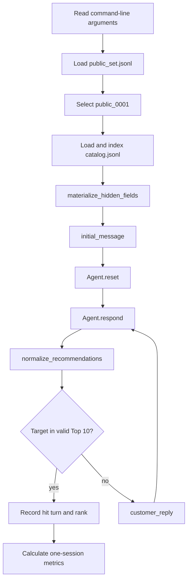
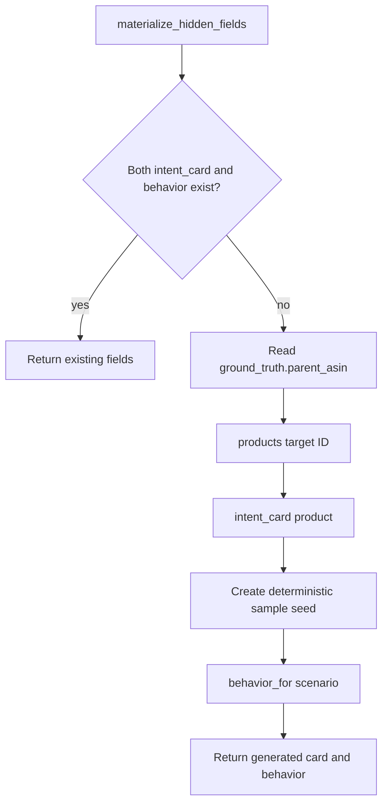
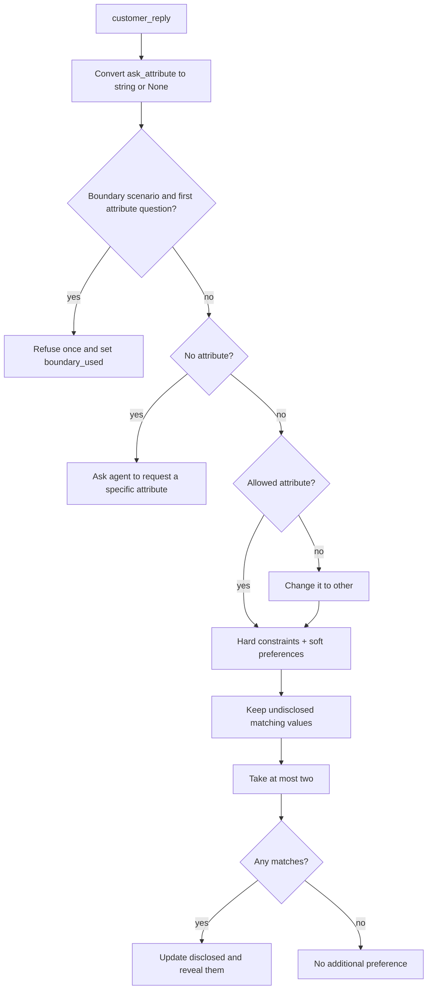
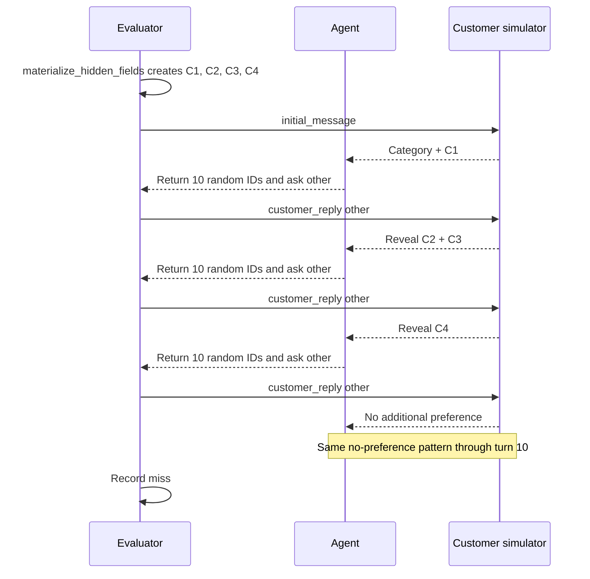

# Execution Walkthrough: `public_0001`

This guide explains what happens when you run:

```bash
python scripts/trace_evaluate.py --sample-id public_0001
```

The trace script is an educational copy of the important control flow inside
`evaluate()`. It uses the real catalog, `Agent`, and evaluator helper functions,
but runs only one sample and exposes intermediate values that are normally
hidden.

> **Important:** the trace displays the secret target product for learning. Do
> not use target information inside the agent implementation.

## 1. High-level flow



For this sample, the target never appears in the ten recommendations. The loop
therefore runs all ten turns and records a miss.

## 2. The selected sample

The dataset row is approximately:

```python
sample = {
    "category_bucket": "clothing",
    "difficulty_bucket": "easy",
    "ground_truth": {
        "parent_asin": "B09PYB7B6Z",
    },
    "sample_id": "public_0001",
    "scenario_type": "buying",
    "user_profile": {
        "average_prior_rating": 5.0,
        "preference_tags": ["fit", "comfort", "durability"],
        "purchase_frequency": "3-4 prior purchases",
        "rating_style": "usually positive",
        "summary": (
            "Prior purchases emphasize fit, comfort, durability; "
            "ratings are usually positive."
        ),
    },
}
```

The secret target is:

```text
parent_asin: B09PYB7B6Z
title: QIAN0813 Celtic Knot Triple Moon Pentagram ... Necklace
categories: Clothing, Shoes & Jewelry > Boys > Jewelry > Necklaces
price: $9.99
```

The agent receives the profile, but it does **not** receive `ground_truth` or
the target product record.

## 3. Loading and selecting the sample

The trace begins with:

```python
samples = local_evaluator.load_jsonl(args.dataset)
sample = choose_sample(samples, args.sample_id, args.scenario, args.index)
```

`load_jsonl()` parses each non-empty line of `data/public_set.jsonl`. Because
the command supplies `--sample-id public_0001`, `choose_sample()` searches for
that exact ID instead of using `--scenario` or `--index`.

Next:

```python
catalog_ids, categories, products = local_evaluator.catalog_index(args.catalog)
```

This creates three different views of the catalog:

| Variable | Used for |
|---|---|
| `catalog_ids` | Rejecting nonexistent agent recommendations |
| `categories` | Building a readable opening category |
| `products` | Looking up titles and deriving hidden intent |

## 4. `materialize_hidden_fields()`

This is the first confusing but important function.

### Why it is needed

The public sample does not contain:

```python
sample["intent_card"]
sample["behavior"]
```

Those fields would reveal too much about the hidden target. The evaluator
reconstructs them locally from the target product:

```python
intent_card, behavior = materialize_hidden_fields(sample, products)
```

### Decision made by the function



For `public_0001`, the second branch runs:

```python
target = "B09PYB7B6Z"
product = products[target]
card = intent_card(product)
behavior = behavior_for("buying", card, rng)
```

### Generated intent card

The actual card is:

```python
{
    "target_category": (
        "QIAN0813 Celttic Knot Triple Moon Pentagram Pentacle Star "
        "Wicca Pendant Necklace Round Pagan Jewelry"
    ),
    "hard_constraints": [
        "Material:alloy",
        "Triple Moon Pentagram Symbol",
    ],
    "soft_preferences": [
        "The Triple Moon represents the Phases of the Moon ...",
        "♥ a special gift to your wife/mom/girlfriend/...",
    ],
}
```

For readability, this guide labels the four constraints:

| Label | Type | Value |
|---|---|---|
| C1 | Hard | `Material:alloy` |
| C2 | Hard | `Triple Moon Pentagram Symbol` |
| C3 | Soft | Long Triple Moon description |
| C4 | Soft | Long gift-occasion description |

`intent_card()` selects the first two cleaned candidates as hard constraints
and the next two as soft preferences. `alloy` is not one of the evaluator's
specially recognized materials; `Material:alloy` survives because it appears
as an ordinary product feature/detail.

### Generated behavior

```python
{"scenario_type": "buying"}
```

Only `intent_override` scenarios receive an additional scheduled override.
Because this is `buying`, there is no change-of-mind message.

### Creating `effective_sample`

The trace follows `evaluate()` and combines the public and generated data:

```python
effective_sample = {
    **sample,
    "intent_card": intent_card,
    "behavior": behavior,
}
```

The original `sample` is not mutated. `effective_sample` is the complete
version used by the customer simulator.

## 5. `initial_message()`

Before calling it, the evaluator creates conversation state:

```python
disclosed = set()
boundary_used = False
override_applied = True
```

`override_applied` starts as `True` because this is not an intent-override
scenario.

The raw category list is simplified first:

```python
coarse_category([
    "Clothing, Shoes & Jewelry",
    "Boys",
    "Jewelry",
    "Necklaces",
])
```

Result:

```text
Jewelry Necklaces
```

Generic clothing roots are discarded, and the two most specific remaining
parts are retained.

The evaluator then calls:

```python
user_message = initial_message(
    effective_sample,
    "Jewelry Necklaces",
    disclosed,
)
```

### Branch taken for this sample

The relevant logic is:

```python
if scenario == "buying" and hard_constraints:
    constraint = hard_constraints[0]
    disclosed.add(constraint)
    return (
        f"I'm looking for {category}. "
        f"A key requirement is: {constraint}."
    )
```

Therefore, the first user message is:

```text
I'm looking for Jewelry Necklaces. A key requirement is: Material:alloy.
```

The state changes at the same time:

```python
disclosed == {"Material:alloy"}  # C1
```

This mutation is easy to miss. `initial_message()` does not only return text;
it also records that C1 has already been revealed so `customer_reply()` will
not repeat it.

### Other scenario branches

| Scenario | Opening behavior |
|---|---|
| `buying` | Reveal the first hard constraint |
| `intent_override` | State the old preference that will later be replaced |
| `browsing` | Say the customer is still exploring |
| `boundary` | Also begin with the generic exploring message |

## 6. `Agent.reset()` and `Agent.respond()`

The trace creates a readable session ID:

```python
session_id = "trace_public_0001"
agent.reset(session_id, sample["user_profile"])
```

Then every turn calls:

```python
response = agent.respond(
    session_id,
    user_message,
    turn,
    TOP_K,
)
```

The current Day 1 agent has four empty retrieval routes. It therefore fills
the response with ten deterministic random catalog IDs and returns:

```python
{
    "message": "I am refining the shortlist. What else should I consider?",
    "ask_attribute": "other",
    "recommendations": [10 product dictionaries],
    "usage": {"prompt_tokens": 0, "completion_tokens": 0},
}
```

The random fill is stable, but it does not use the newly disclosed shopping
constraints for retrieval. Customer replies therefore do not improve this
temporary baseline yet.

## 7. Recommendation normalization and scoring

The evaluator does not score the raw list immediately:

```python
ranked = normalize_recommendations(
    response.get("recommendations"),
    catalog_ids,
)
```

Normalization:

1. Requires the outer value to be a list.
2. Extracts `parent_asin` from dictionaries.
3. Removes blank IDs.
4. Removes duplicates.
5. Removes IDs absent from the catalog.
6. Keeps the first ten valid unique IDs.

The hit check is:

```python
if override_applied and target in ranked:
    best_rank = ranked.index(target) + 1
    hit_turn = turn
    break
```

For all ten turns of `public_0001`:

```text
target present = False
override applied = True
eligible hit = False
```

## 8. `customer_reply()` in detail

After a miss, the evaluator needs the next simulated customer message:

```python
user_message, boundary_used = customer_reply(
    effective_sample,
    response.get("ask_attribute"),
    disclosed,
    boundary_used,
)
```

The current agent always supplies:

```python
ask_attribute = "other"
```

### Internal decision flow



The combined ordered list is:

```python
constraints = [C1, C2, C3, C4]
```

Matching uses:

```python
value not in disclosed and (
    attribute == "other"
    or classify_constraint(value) == attribute
)
```

`"other"` is special: it bypasses `classify_constraint()` and matches any
undisclosed constraint. The final `[:2]` means at most two are revealed in one
reply.

### After agent turn 1

Before the call:

```python
disclosed = {C1}
```

The undisclosed values are C2, C3, and C4. Because only two are allowed, the
matches are:

```python
[C2, C3]
```

The next user message becomes:

```text
For that, what matters is: Triple Moon Pentagram Symbol;
The Triple Moon represents the Phases of the Moon ...
```

State afterward:

```python
disclosed = {C1, C2, C3}
```

### After agent turn 2

Only C4 remains undisclosed, so the reply reveals it:

```text
For that, what matters is: ♥ a special gift to your
wife/mom/girlfriend/daughter/grandmother/best friend/...
```

State afterward:

```python
disclosed = {C1, C2, C3, C4}
```

### After agent turn 3 and later

No constraints remain. `matches` is empty, so the reply is:

```text
I don't have an additional preference for other.
```

The same reply repeats after later misses because no new preference can be
revealed.

### What if the agent returned another attribute?

If the agent returned `"color"`, only undisclosed constraints classified as
color would match. If it returned `None`, the reply would instead be:

```text
Those options are not quite right yet. Ask me about one specific attribute.
```

For this product, `Material:alloy` is not classified as `material` by
`classify_constraint()` because `alloy` is absent from the evaluator's fixed
material vocabulary. This illustrates why heuristic classification can have
surprising gaps. In this sample C1 is already disclosed by `initial_message()`,
so that gap does not affect subsequent replies.

## 9. Complete state timeline

The message shown in each row is the input to that agent turn.

| Agent turn | User message summary | Disclosed before call | Agent asks | Hit? |
|---:|---|---|---|---|
| 1 | Looking for necklaces; requires C1 | C1 | `other` | No |
| 2 | C2 and C3 matter | C1, C2, C3 | `other` | No |
| 3 | C4 matters | C1, C2, C3, C4 | `other` | No |
| 4 | No additional preference | C1–C4 | `other` | No |
| 5 | No additional preference | C1–C4 | `other` | No |
| 6 | No additional preference | C1–C4 | `other` | No |
| 7 | No additional preference | C1–C4 | `other` | No |
| 8 | No additional preference | C1–C4 | `other` | No |
| 9 | No additional preference | C1–C4 | `other` | No |
| 10 | No additional preference | C1–C4 | `other` | No |



## 10. Final metrics for this sample

Because the target was never recommended:

```python
session_result = {
    "sample_id": "public_0001",
    "scenario_type": "buying",
    "hit": False,
    "first_hit_turn": None,
    "best_rank": None,
    "reciprocal_rank": 0.0,
}
```

For metric calculation, a miss receives turn 11:

```python
{
    "sample_count": 1,
    "hit_rate_at_10": 0.0,
    "mrr": 0.0,
    "mttc": 11.0,
    "efficiency": 0.0,
    "recommended_technical_score": 0.0,
}
```

## 11. The three most important ideas

1. **`materialize_hidden_fields()` constructs the simulator's secret plan.**
   It turns the target catalog product into an intent card and scenario
   behavior when the public sample does not contain them.

2. **`initial_message()` reveals the starting amount of intent.** For a buying
   scenario, it reveals the first hard constraint and mutates `disclosed` so
   that constraint is not repeated.

3. **`customer_reply()` controls progressive disclosure.** The agent's
   `ask_attribute` determines which undisclosed constraints can be revealed.
   `"other"` matches any type, but only two constraints are returned per turn.

These functions do not retrieve products. They control what information the
agent receives. Product retrieval happens inside `Agent.respond()`, and the
evaluator only judges the normalized recommendation IDs.

## 12. Recommended commands while reading

First, view the current source alongside line numbers:

```bash
python scripts/trace_evaluate.py --source-only
```

Then focus on one turn:

```bash
python scripts/trace_evaluate.py --sample-id public_0001 --max-turns 1
```

Finally, compare the first four turns, where all meaningful disclosure occurs:

```bash
python scripts/trace_evaluate.py --sample-id public_0001 --max-turns 4
```

After turn 3, all four hidden constraints have already been disclosed, so
turns 4–10 mainly demonstrate repeated misses and the no-additional-preference
fallback.

## 13. Note about the current local evaluator

At the time this guide was generated, the working copy of
`evaluator/local_evaluator.py` contained temporary debug `print()` statements
and an unconditional `break` after appending the first session. The trace
script does not call that modified `evaluate()` loop; it mirrors the intended
single-session logic using the real helper functions. This keeps the learning
output structured without making further evaluator changes.
